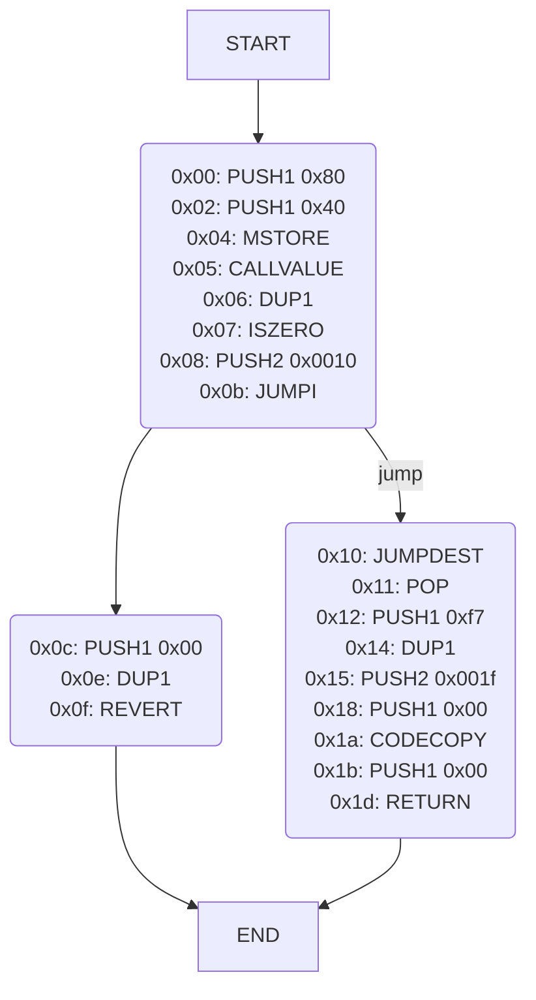

# erever

erever is a CLI tool designed for reversing EVM bytecodes.
erever is specially optimized for solving CTF challenges and is intended to be used for intricate operations.
While erever is powerful for specific needs, for general reversing tasks, I recommend using other useful tools, such as the debugger included in Foundry.
Currently, erever is very experimental and primarily developed for my personal problem-solving purposes.
If you encounter any issues or have suggestions for improvements while using erever, please feel free to open an issue!

**Table of Contents**
- [Writeups with erever](#writeups-with-erever)
- [Install](#install)
- [Usage](#usage)
  - [Disassemble](#disassemble)
  - [Trace](#trace)
  - [Symbolic Trace](#symbolic-trace)
  - [Generate Mermaid Diagram](#generate-mermaid-diagram)
  - [Find JOP Gadgets](#find-jop-gadgets)
  - [Assemble](#assemble)
  - [Tips](#tips)
- [Development](#development)
  - [Test](#test)

## Writeups with erever
- [Paradigm CTF 2022: SOURCECODE](https://github.com/minaminao/ctf-blockchain/tree/main/src/ParadigmCTF2022#sourcecode)
- [DownUnderCTF 2022: EVM Vault Mechanism](https://github.com/minaminao/ctf-blockchain/tree/main/src/DownUnderCTF2022/EVMVaultMechanism)
- [EKOPARTY CTF 2022: Byte](https://github.com/minaminao/ctf-blockchain/tree/main/src/EkoPartyCTF2022)
- [EKOPARTY CTF 2022: SmartRev](https://github.com/minaminao/ctf-blockchain/tree/main/src/EkoPartyCTF2022)
- [Numen Cyber CTF 2023: LittleMoney](https://github.com/minaminao/ctf-blockchain/tree/main/src/NumenCTF)
- [Numen Cyber CTF 2023: HEXP](https://github.com/minaminao/ctf-blockchain/tree/main/src/NumenCTF)
- [Paradigm CTF 2023: Cosmic Radiation](https://github.com/minaminao/ctf-blockchain/tree/main/src/ParadigmCTF2023/CosmicRadiation)
- [Curta: Lana](https://twitter.com/vinami/status/1728482477965213760)

## Install

To install erever, simply run the following command:

```
pip install git+https://github.com/minaminao/erever.git
```

Note: Only supports Python >= 3.12.

## Usage

erever has the following subcommands:
- `disassemble`: Disassemble EVM bytecode into a more readable format.
- `trace`: Traces an execution for EVM bytecode.
- `symbolic-trace`: Performs symbolic execution tracing on EVM bytecode.
- `mermaid`: Generates a mermaid diagram to represent EVM bytecode structure visually.
- `gadget`: Searches for JOP (Jump-Oriented Programming) gadgets within EVM bytecode.
- `assemble`: Converts assembly instructions to EVM bytecode.

For detailed information on each command and its options, you can access the help message by running such commands:

```
erever -h
erever <COMMAND> -h
```

### Disassemble

The `disassemble` command is used to break down EVM bytecode into its assembly language representation, making it easier to understand and analyze.

Usage:
```
erever disassemble <OPTIONS>
```

Let's walk through some examples of using the `disassemble` command.

First, we will disassemble the bytecode of a quine I used in the Paradigm CTF 2022 "SOURCECODE" challenge.
The bytecode is compiled using the Huff language, and you can find the file at the following link: [ctf-blockchain/src/ParadigmCTF2022/SourceCode/Quine35Bytes.huff at main · minaminao/ctf-blockchain](https://github.com/minaminao/ctf-blockchain/blob/main/src/ParadigmCTF2022/SourceCode/Quine35Bytes.huff).

To disassemble the bytecode, run the following command:

```
$ erever disassemble -b "70806011526000526070600e536023600ef3806011526000526070600e536023600ef3"
0x00: PUSH17 0x806011526000526070600e536023600ef3
0x12: DUP1
0x13: PUSH1 0x11
0x15: MSTORE
0x16: PUSH1 0x00
0x18: MSTORE
0x19: PUSH1 0x70
0x1b: PUSH1 0x0e
0x1d: MSTORE8
0x1e: PUSH1 0x23
0x20: PUSH1 0x0e
0x22: RETURN
```

The `-b` option specifies the byte code.
At the beginning of each line, the offset of the bytecode is displayed.

<!-- 
Additionally, as metadata, CBOR decoding is also performed.
In this bytecode, since CBOR does not exist, `CBOR: Not found` will be displayed.
For more information about CBOR, refer to [Contract Metadata](https://docs.soliditylang.org/en/v0.8.23/metadata.html) in the Solidity documentation.

If CBOR data exists, it will be decoded as follows.
The bytecode is from the BlazCTF "Missing" challenge.
You can also use the abbreviated `disas` command and specify a TOML file using the `-f` option.

```
$ erever disas -f examples/blazctf_missing.toml
(snip)

CBOR: length = 51
CBOR: ipfs = https://ipfs.io/ipfs/QmWZ2kq9CfgKHkXYghaeKM2mcYZxsZP2ibrgXkPK6ivjk5
CBOR: ipfs content = b'It seems that you have found something interesting:\n0xb416d860b4699c727446b264d19467f4591939192005d81a77c91a3c92341d9e\n0x852b579100b5a5632a61de136bcc067fb6d6d18cda593e6c56abd23e3de949e6\n0x349450f2e567bd69711230624ab9fbe97d949c218029f4e795bc94b780cff2ae\n0xb...'
CBOR: solc = 0.8.23
```

In addition to decoding CBOR data, if IPFS data is included in the metadata, its content is automatically fetched and displayed.
If the content is lengthy, it will be abbreviated with `...`. -->

You can also use RPC to disassemble a bytecode on the blockchain.
For example, if you want to disassemble the bytecode of [Beacon Deposit Contract](https://etherscan.io/address/0x00000000219ab540356cbb839cbe05303d7705fa) on the Ethereum mainnet, you can use the following command:

```
erever disas -c 0x00000000219ab540356cBB839Cbe05303d7705Fa --rpc-url $RPC_URL
```

### Trace

The `trace` command is used to trace the execution of EVM bytecode.

Usage:
```
erever trace <OPTIONS>
```

If you want to trace the execution of the bytecode of the quine we used in the previous example, you can use the following command:

```
$ erever trace -b "70806011526000526070600e536023600ef3806011526000526070600e536023600ef3"
0x00: PUSH17 0x806011526000526070600e536023600ef3
   stack    [0x806011526000526070600e536023600ef3]
0x12: DUP1(0x806011526000526070600e536023600ef3)
   stack    [0x806011526000526070600e536023600ef3, 0x806011526000526070600e536023600ef3]
0x13: PUSH1 0x11
   stack    [0x11, 0x806011526000526070600e536023600ef3, 0x806011526000526070600e536023600ef3]
0x15: MSTORE(offset:0x11, x:0x806011526000526070600e536023600ef3)
   stack    [0x806011526000526070600e536023600ef3]
  memory    0000000000000000000000000000000000000000000000000000000000000000 | ................................ | 0x0
            806011526000526070600e536023600ef3000000000000000000000000000000 | .`.R`.R`p`.S`#`................. | 0x20
0x16: PUSH1 0x00
   stack    [0x00, 0x806011526000526070600e536023600ef3]
0x18: MSTORE(offset:0x00, x:0x806011526000526070600e536023600ef3)
   stack    []
  memory    000000000000000000000000000000806011526000526070600e536023600ef3 | ................`.R`.R`p`.S`#`.. | 0x0
            806011526000526070600e536023600ef3000000000000000000000000000000 | .`.R`.R`p`.S`#`................. | 0x20
0x19: PUSH1 0x70
   stack    [0x70]
0x1b: PUSH1 0x0e
   stack    [0x0e, 0x70]
0x1d: MSTORE8(offset:0x0e, x:0x70)
   stack    []
  memory    000000000000000000000000000070806011526000526070600e536023600ef3 | ..............p.`.R`.R`p`.S`#`.. | 0x0
            806011526000526070600e536023600ef3000000000000000000000000000000 | .`.R`.R`p`.S`#`................. | 0x20
0x1e: PUSH1 0x23
   stack    [0x23]
0x20: PUSH1 0x0e
   stack    [0x0e, 0x23]
0x22: RETURN(offset:0x0e, size:0x23)
  return    70806011526000526070600e536023600ef3806011526000526070600e536023600ef3
   stack    []
  memory    000000000000000000000000000070806011526000526070600e536023600ef3 | ..............p.`.R`.R`p`.S`#`.. | 0x0
            806011526000526070600e536023600ef3000000000000000000000000000000 | .`.R`.R`p`.S`#`................. | 0x20
```


By default, the stack is always displayed, and the memory is printed only at the time of writing.
If you want to always display the memory, use the `--memory-display always` option as follows:

```
erever trace -b "70806011526000526070600e536023600ef3806011526000526070600e536023600ef3" --memory-display always
```

If you don't want to display the memory, use the `--memory-display off` option.

Also, if you want to display only some parts of the memory, use the `--memory-range` option.

```
erever trace -b "70806011526000526070600e536023600ef3806011526000526070600e536023600ef3" --memory-display always --memory-range 0x20 0x40
```

Additionally, the context at runtime can be customized with options:

```
context options:
  --address ADDRESS                        Address of the contract (default: 182267477)
  --origin ORIGIN                          Origin of the transaction (default: 0)
  --caller CALLER                          Caller of the transaction (default: 0)
  --callvalue CALLVALUE                    Call value of the transaction (default: 0)
  --calldata CALLDATA                      Call data of the transaction (default: )
  --gasprice GASPRICE                      Gas price of the transaction (default: 0)
  --coinbase COINBASE                      Coinbase of the block (default: 0)
  --timestamp TIMESTAMP                    Timestamp of the block (default: 0)
  --number NUMBER                          Number of the block (default: 0)
  --difficulty DIFFICULTY                  Difficulty of the block (default: 0)
  --gaslimit GASLIMIT                      Gas limit of the block (default: 0)
  --chainid CHAINID                        Chain ID of the block (default: 1)
  --selfbalance SELFBALANCE                Balance of the contract (default: 0)
  --basefee BASEFEE                        Base fee of the block (default: 0)
  --gas GAS                                Gas of the transaction (default: (1 << 256) - 1)
```

Also, by using a TOML file, it is possible to overwrite some codes, balances, and storage values at runtime:

```
[state.code]
0x03f6296A2412CbC9B8239387f0ca0e94Ba2d6A99 = "0x60ff"

[state.balance]
0x03f6296A2412CbC9B8239387f0ca0e94Ba2d6A99 = "100"

[state.storage]
0xADD2E55 = { "0" = "0x34", "1" = "0x4142434445464748494a4b4c4d4e4f505152535455565758595a414243444546", "2" = "0x4748494a4b4c4d4e4f505152535455565758595a000000000000000000000000" }
```

You can also use RPC to trace the execution of a transaction.

For example, if you want to trace the execution of the contract creation transaction for [Beacon Deposit Contract](https://etherscan.io/address/0x00000000219ab540356cbb839cbe05303d7705fa) on the Ethereum mainnet, you can use the following command:

```
erever trace --tx 0xe75fb554e433e03763a1560646ee22dcb74e5274b34c5ad644e7c0f619a7e1d0 --rpc-url $RPC_URL
```

**Note: Basically, erever interprets the number as hexadecimal if it is prefixed with `0x`, and as decimal otherwise.**

### Symbolic Trace

The `symbolic-trace` command is used to perform symbolic execution tracing on EVM bytecode. This feature is experimental.

```
erever symbolic-trace <OPTIONS>
```

**Example**:

```
$ erever symbolic-trace -b 0x6080604052600436106100385760003560e01c80634b64e4921461004457806380e10aa514610066578063b15be2f51461006e57600080fd5b3661003f57005b600080fd5b34801561005057600080fd5b5061006461005f366004610300565b610083565b005b61006461018e565b34801561007a57600080fd5b5061006461022a565b6040805163bfa814b560e01b602082015282916000916001600160a01b038416910160408051601f19818403018152908290526100bf91610330565b600060405180830381855af49150503d80600081146100fa576040519150601f19603f3d011682016040523d82523d6000602084013e6100ff565b606091505b5050905080156101425760405162461bcd60e51b81526020600482015260096024820152686e6f20636f7665722160b81b60448201526064015b60405180910390fd5b60008061014d610251565b909250905043821461015e57600080fd5b604080516020810190915261022a820180825261017d9063ffffffff16565b5050505061018a81610280565b5050565b6000546001600160a01b031633146101a557600080fd5b346001146101f55760405162461bcd60e51b815260206004820152601b60248201527f49206f6e6c79206e6565642061206c6974746c65206d6f6e65792100000000006044820152606401610139565b6040513381527f2d3bd82a572c860ef85a36e8d4873a9deed3f76b9fddbf13fbe4fe8a97c4a5799060200160405180910390a1565b6000546001600160a01b031661023f57600080fd5b600080546001600160a01b0319169055565b60008060403d1461026157600080fd5b60405160406000823e63ffffffff815116925080602001519150509091565b600061028b826102dc565b9050806102c75760405162461bcd60e51b815260206004820152600a6024820152693832b936b4b9b9b4b7b760b11b6044820152606401610139565b336001600160a01b0383161461018a57600080fd5b6000813b806102ee5750600092915050565b600c8111156100645750600092915050565b60006020828403121561031257600080fd5b81356001600160a01b038116811461032957600080fd5b9392505050565b6000825160005b818110156103515760208186018101518583015201610337565b81811115610360576000828501525b50919091019291505056fea2646970667358221220f9b740c6afb3d0144cfc4fde3b00baa8b2e5d087e61ef21d572db9ba3095d36a64736f6c634300080c0033 --max-steps 15 --show-symbolic-stack

0x000
0x000: PUSH1(0x80)
   stack    [0x80]
0x002: PUSH1(0x40)
   stack    [0x40, 0x80]
0x004: MSTORE(0x40, 0x80)
   stack    []
0x005: PUSH1(0x04)
   stack    [0x04]
0x007: CALLDATASIZE()
   stack    [CALLDATASIZE(), 0x04]
0x008: CALLDATASIZE() < 0x04
   stack    [(CALLDATASIZE() < 0x04)]
0x009: PUSH2(0x38)
   stack    [0x38, (CALLDATASIZE() < 0x04)]
0x00c: JUMPI(0x38, CALLDATASIZE() < 0x04)
   stack    []

0x038 (<- 0x00c)
   0x00c: (CALLDATASIZE() < 0x04) == true
0x038: JUMPDEST()
   stack    []
0x039: CALLDATASIZE()
   stack    [CALLDATASIZE()]
0x03a: PUSH2(0x3f)
   stack    [0x3f, CALLDATASIZE()]
0x03d: JUMPI(0x3f, CALLDATASIZE())
   stack    []

0x00d (<- 0x00c)
   0x00c: (CALLDATASIZE() < 0x04) == false
0x00d: PUSH1(0x00)
   stack    [0x00]
0x00f: CALLDATALOAD(0x00)
   stack    [CALLDATALOAD(0x00)]
0x010: PUSH1(0xe0)
   stack    [0xe0, CALLDATALOAD(0x00)]
0x012: CALLDATALOAD(0x00) >> 0xe0
   stack    [(CALLDATALOAD(0x00) >> 0xe0)]
0x013: DUP1() # (CALLDATALOAD(0x00) >> 0xe0)
   stack    [(CALLDATALOAD(0x00) >> 0xe0), (CALLDATALOAD(0x00) >> 0xe0)]
0x014: PUSH4(0x4b64e492)
   stack    [0x4b64e492, (CALLDATALOAD(0x00) >> 0xe0), (CALLDATALOAD(0x00) >> 0xe0)]
0x019: 0x4b64e492 == (CALLDATALOAD(0x00) >> 0xe0)
   stack    [(0x4b64e492 == (CALLDATALOAD(0x00) >> 0xe0)), (CALLDATALOAD(0x00) >> 0xe0)]
The maximum number of steps has been reached.

0x03f (<- 0x03d)
   0x00c: (CALLDATASIZE() < 0x04) == true
   0x03d: CALLDATASIZE() == true
0x03f: JUMPDEST()
   stack    []
0x040: PUSH1(0x00)
   stack    [0x00]
0x042: DUP1() # 0x00
   stack    [0x00, 0x00]
The maximum number of steps has been reached.

0x03e (<- 0x03d)
   0x00c: (CALLDATASIZE() < 0x04) == true
   0x03d: CALLDATASIZE() == false
0x03e: STOP()
   stack    []
```

### Generate Mermaid Diagram

The `mermaid` command is used to generate a mermaid diagram to represent EVM bytecode structure visually.
This feature is experimental, and I recommend [Bytegraph](https://bytegraph.xyz/) to show the CFG of the bytecode.

```
erever mermaid <OPTIONS>
```

**Example Output**:



### Find JOP Gadgets

The `gadget` command is used to search for JOP (Jump-Oriented Programming) gadgets within EVM bytecode. This feature is experimental.

```
erever gadget -b <BYTECODE>
```

### Assemble

The `assemble` command is used to convert assembly instructions to EVM bytecode.

```
$ erever assemble "PUSH0 PUSH1 0x10"
5f6010
```

### Tips
- It is useful in combination with commands such as `less -R`.

## Development

### Test

The tests are written using pytest and can be found in the `tests` directory.

To run the tests, execute the following command:

```
rye test
```
